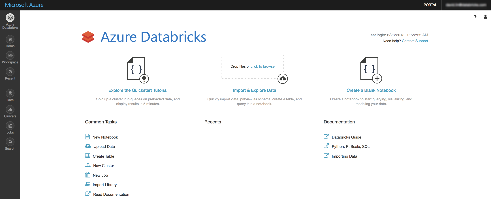

*******************
Databricks Course
*******************

.. contents:: Table of Contents

Introduction to Databricks
----------------------------

Welcome to Databricks Guide.

- Databricks is an organization and big data processing platform founded by the creators of Apache Spark.
- Azure Databricks is an Apache Spark-based analytics platform optimized for the Microsoft Azure cloud services platform. 
- Databricks is integrated with Azure to provide one-click setup, streamlined workflows, and an interactive workspace that enables collaboration between data scientists, data engineers, and business analysts.

Prerequsites
--------------
- The pre-requisites for Databricks course include the basic understanding of Computer Programming Languages e.g. Python, Scala.
- Fundamentals of Data Analysis practiced over any of the data analysis tools like R will be a plus.
- Spark Concepts (RDD, Transformations, Actions, Join Operation, File Formats, Read/Write to AWS S3, partition)
- Azure/AWS (S3, Redshift, Azure Blob Storage, Azure Data Lake Storage, Azure SQL Data warehouse)
- Hadoop/Hive
- Optional: (Airflow, Docker, Datawarehouse concepts)
- However, you will be provided with complimentary study material for “Basics of Bigdata” as a self-paced course once you enroll for the course.

User Guide
------------------

Week-I
========

Day-1
^^^^^^^^^^

1. Databricks Login:
^^^^^^^^^^^^^^^^^^^^^

- Sign up for Azure free Trial
""""""""""""""""""""""""""""
1. Go to Create your Azure free account today.
2. Click Start free.
3. Choose a credential associated with a Microsoft account or click Use another account.
4. Provide a credential and click Next.
5. Enter a password and click Sign in.
6. Fill in the Email address and Phone fields and click Next.
7. Fill in the Phone number field and choose an identity verification method.
8. Complete the identify verification process.
9. Provide credit card details and click Next.
10. Check the Agreement checkbox and click Sign up.

- Create an Azure Databricks workspace
""""""""""""""""""""""""""""""""""""""
1. Log in to the Azure portal.
2. Select + Create a resource > Analytics > Azure Databricks.
3. In the Azure Databricks Service dialog, provide the workspace configuration.

- Workspace name: Enter a name for your Azure Databricks workspace.
- Subscription: Select your Azure subscription.
- Resource group: Create a new resource group or use an existing one.
- Location: Select a geographical region.
- Pricing Tier: Select a pricing tier. If you select Trial (Premium - 14-Days Free DBUs), the workspace has access to free Premium Azure Databricks DBUs for 14 days.

4. Select Pin to dashboard and then click Create. The portal displays “Deployment in progress”. After a few minutes the Azure Databricks Service page displays.

- Launch the workspace
^^^^^^^^^^^^^^^^^^^^^^^
1.In the Azure Databricks Service page, click Launch Workspace. You’ll see the Azure Databricks workspace home page:

- Introduction to Databricks UI
^^^^^^^^^^^^^^^^^^^^^^^^^^^^^^^^^

